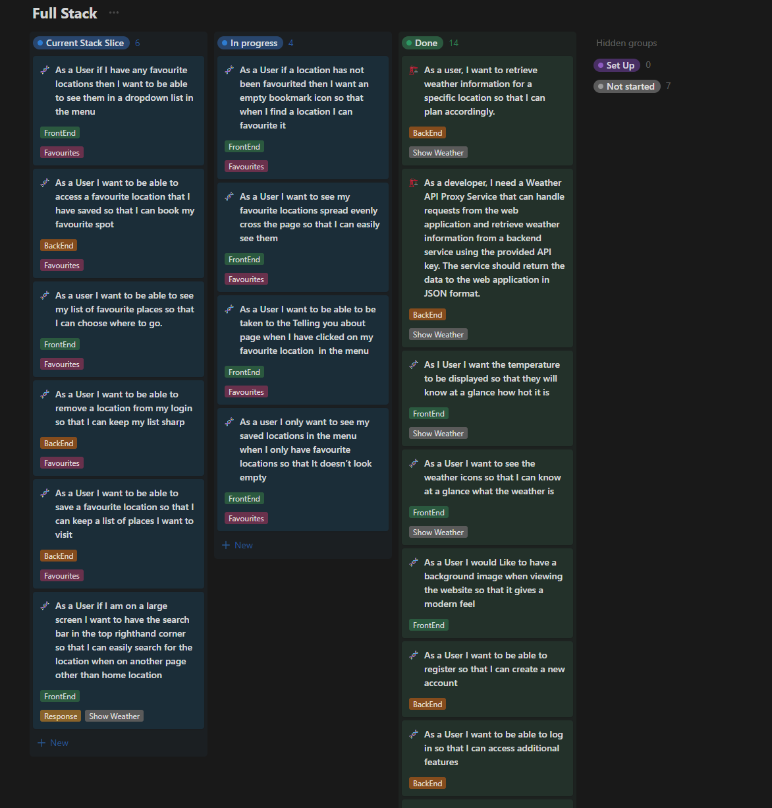
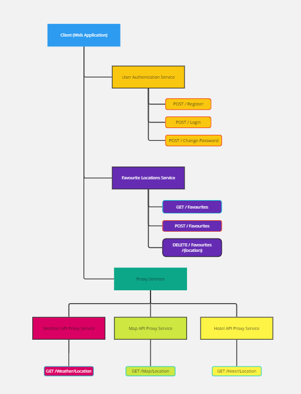
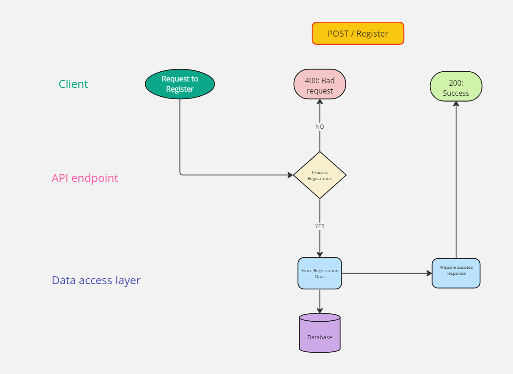
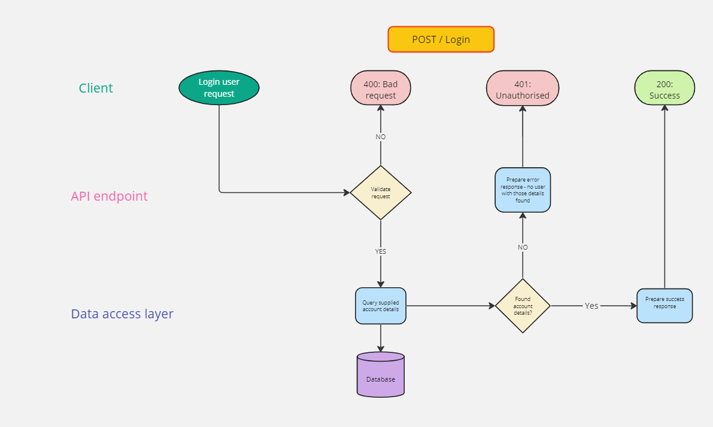
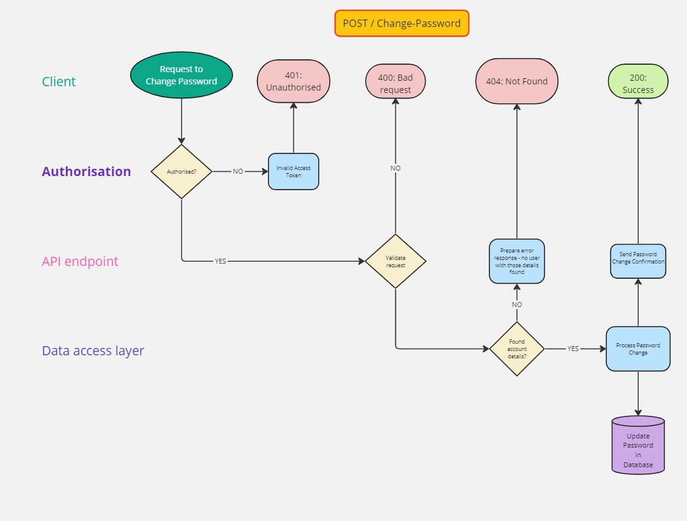
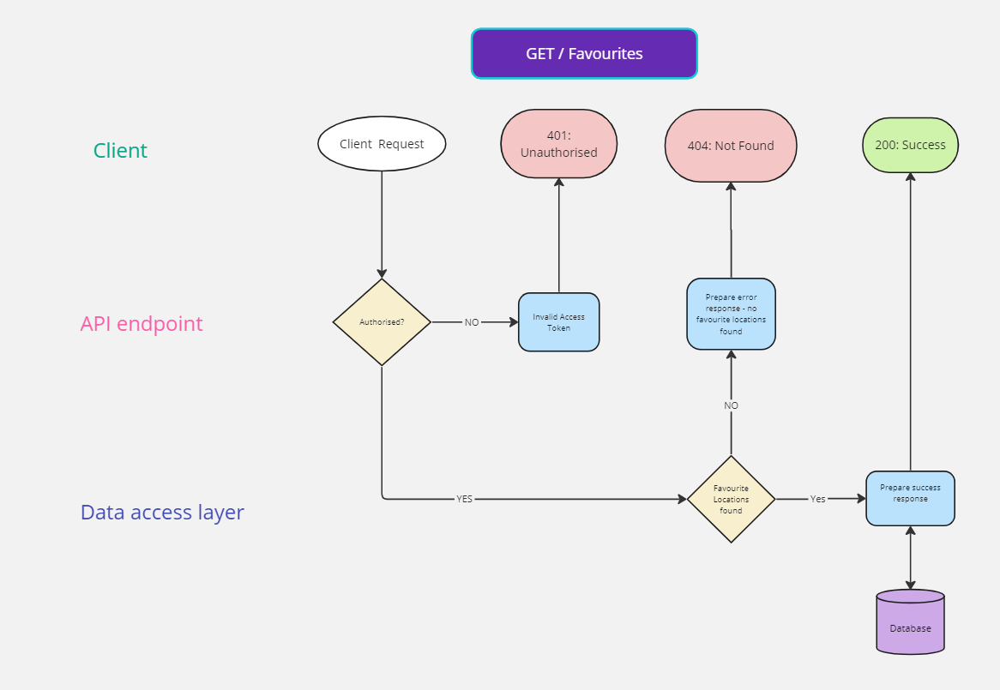
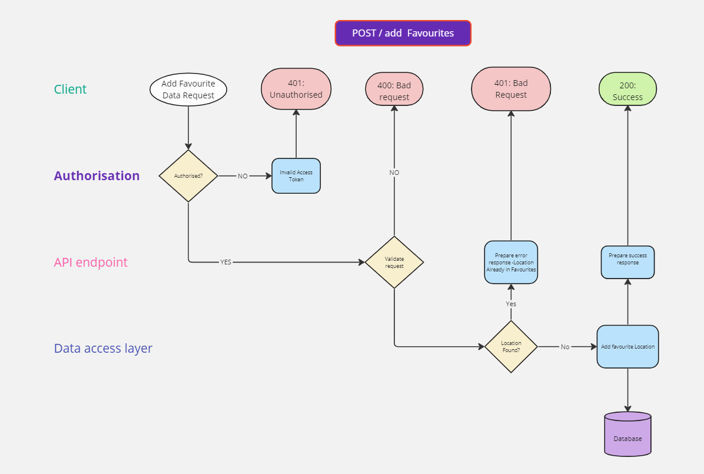
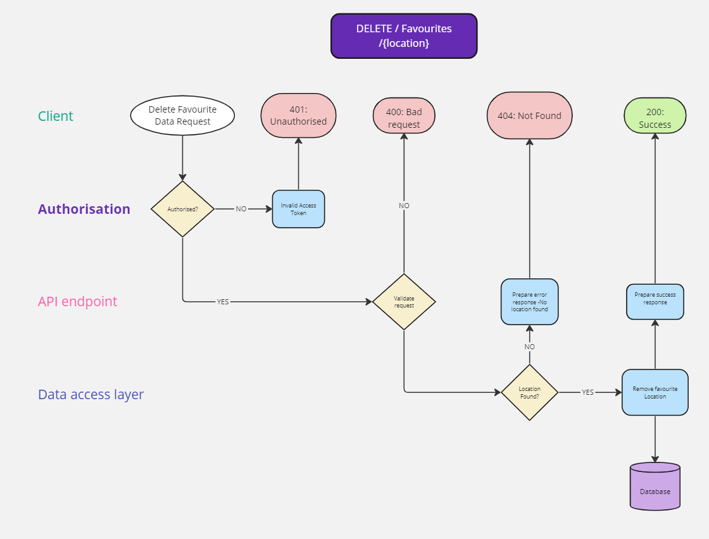
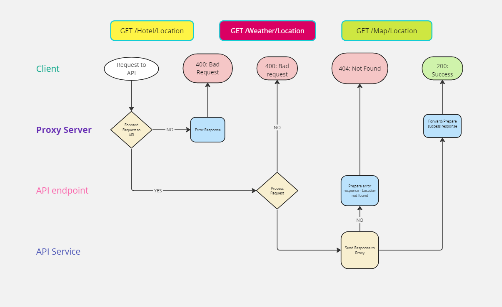

# Challenge Documentation

## Table of Contents

1. [User Stories](#user-stories)
2. [Basic Backend Structure](#basic-backend-structure)
3. [Routing Diagrams](#routing-diagrams)
   - [Registration](#registration)
   - [Login In](#login-in)
   - [Change Password](#change-password)
   - [Get Locations](#get-locations)
   - [Add Locations](#add-locations)
   - [Remove Locations](#remove-locations)
   - [Proxy Routing](#proxy-routing)

## User Stories

## Basic Backend Structure

## Routing Diagrams

### Registration

### Login In

### Change Password

### Get Locations

### Add Locations

### Remove Locations

### Proxy Routing

