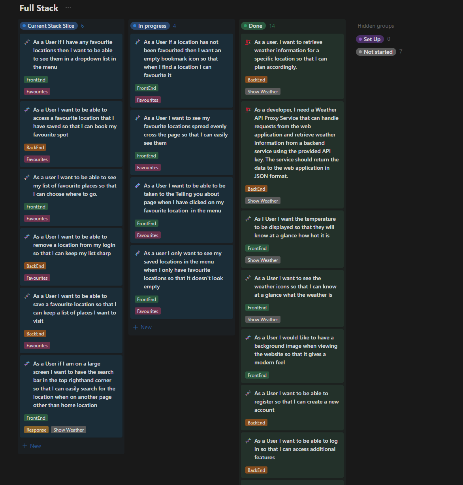
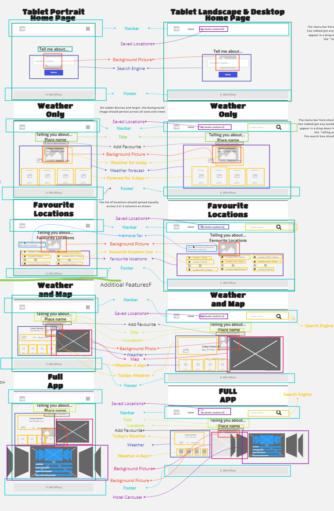
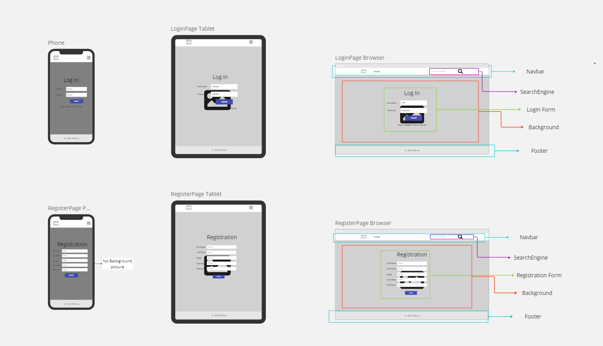
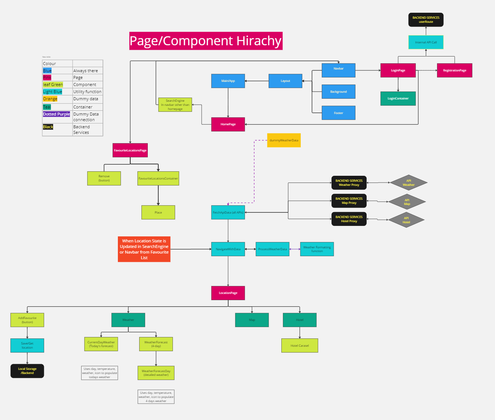
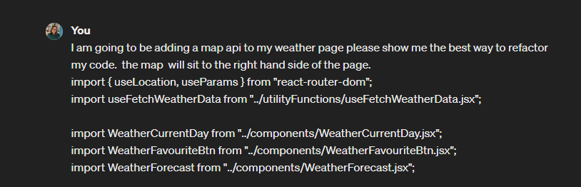
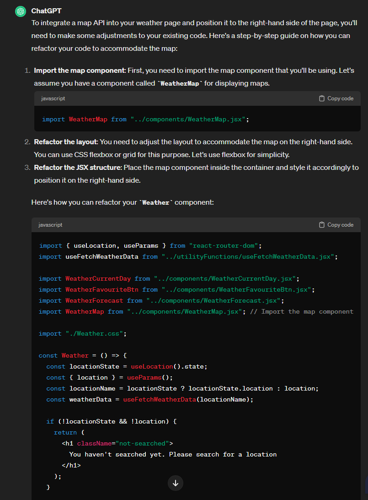
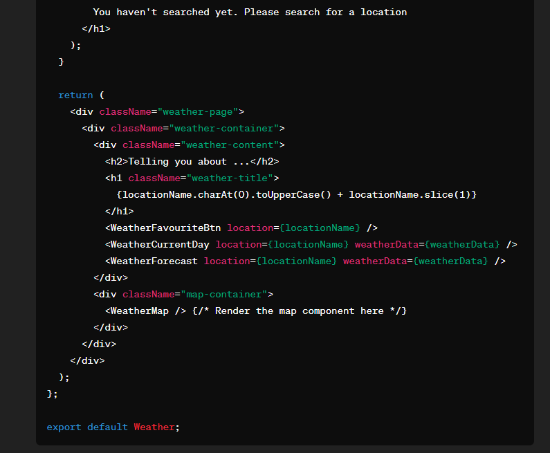
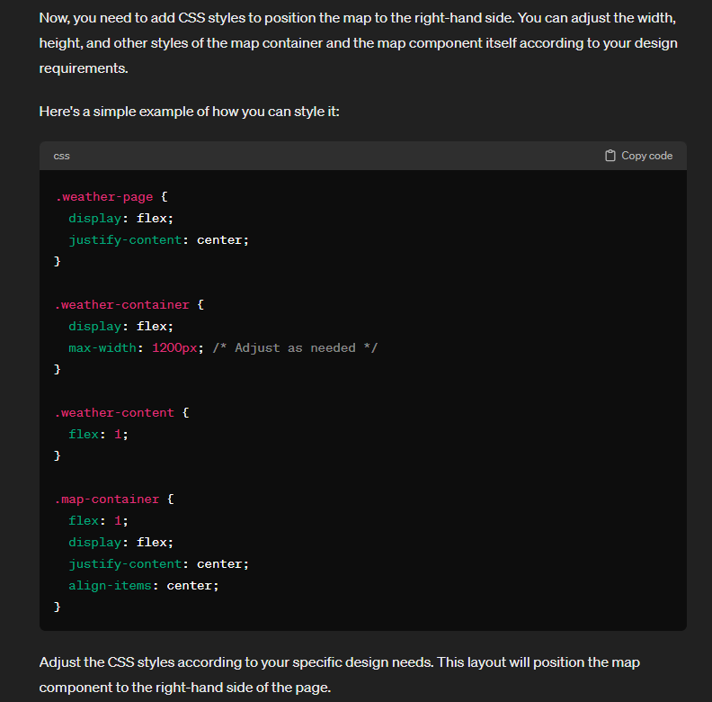

# Challenge Documentation

## State of Play

Frontend: Local storage of Favourite location complete
Front to Backend: connection of Favourite location in progress

## Table of Contents

1. [Component Hierarchy](#component-hierarchy)
   - [Breakdown of Wireframe](#breakdown-of-wireframe)
   - [Login and Registration WireFrames](#login-and-registration-wireframes)
   - [Breakdown of Component Hierarchy used](#breakdown-of-component-hierarchy-used)
2. [State Management](#state-management)
3. [Preparation for Adding Map API](#preparation-for-adding-map-api)

## User Stories

Screen shot of Kanban with User stories

[Back to Table of Contents](#table-of-contents)

## Component Hierarchy

### Breakdown of Wireframe

[Back to Table of Contents](#table-of-contents)

### Login and Registration WireFrames

[Back to Table of Contents](#table-of-contents)

### Breakdown of Component Hierarchy used

[Back to Table of Contents](#table-of-contents)

## State Management

Breakdown of state management within the app

| State             | Is it State | Where does it live          | Does it remain unchanged over time? | Is it passed in from a parent via props? | Can it computed from any other state/props in your component | Why is State Here                                                             |
| ----------------- | ----------- | --------------------------- | ----------------------------------- | ---------------------------------------- | ------------------------------------------------------------ | ----------------------------------------------------------------------------- |
| Location          | Yes         | App                         | No                                  | No                                       | No                                                           | Common Ancestor                                                               |
| Favourite         | Yes         | App                         | No                                  | No                                       | No                                                           | Common Ancestor                                                               |
| User              | Yes         | App                         | No                                  | No                                       | NO                                                           | Common Ancestor                                                               |
| UserDetails       | No          | HandleLogin function in App |                                     |                                          |                                                              | Common Ancestor                                                               |
| favourite         | No          | LocationPage component      | Yes                                 | No                                       | No                                                           | It's used to determine if the current location is a favourite.                |
| onAddFavourite    | No          | LocationPage component      | Yes                                 | No                                       | No                                                           | It's a function used to add the current location to the favourites.           |
| onRemoveFavourite | No          | LocationPage component      | Yes                                 | No                                       | No                                                           | It's a function used to remove the current location from the favourites.      |
| weatherData       | Yes         | LocationPage component      | No                                  | No                                       | Yes, it's derived from the useLocation hook                  | It's used to display the weather data for the current location.               |
| location          | Yes         | LocationPage component      | No                                  | No                                       | Yes, it's derived from the useParams hook                    | It's used to get the current location from the URL parameters.                |
| onLogin           | No          | LoginPage component         | Yes                                 | No                                       | No                                                           | It's a function passed from the parent component to handle the login process. |
| username          | Yes         | LoginPage component         | No                                  | No                                       | No                                                           | It's used to store the input value of the username field.                     |
| password          | Yes         | LoginPage component         | No                                  | No                                       | No                                                           | It's used to store the input value of the password field.                     |
| username          | Yes         | RegistrationPage component  | No                                  | No                                       | No                                                           | It's used to store the input value of the username field.                     |
| password          | Yes         | RegistrationPage component  | No                                  | No                                       | No                                                           | It's used to store the input value of the password field.                     |
| email             | Yes         | RegistrationPage component  | No                                  | No                                       | No                                                           | It's used to store the input value of the email field.                        |
| firstName         | Yes         | RegistrationPage component  | No                                  | No                                       | No                                                           | It's used to store the input value of the first name field.                   |
| lastName          | Yes         | RegistrationPage component  | No                                  | No                                       | No                                                           | It's used to store the input value of the last name field.                    |

[Back to Table of Contents](#table-of-contents)

## Preparation for Adding Map API

### Screenshots of AI code for starting the implementation of the Map API

[Back to Table of Contents](#table-of-contents)
